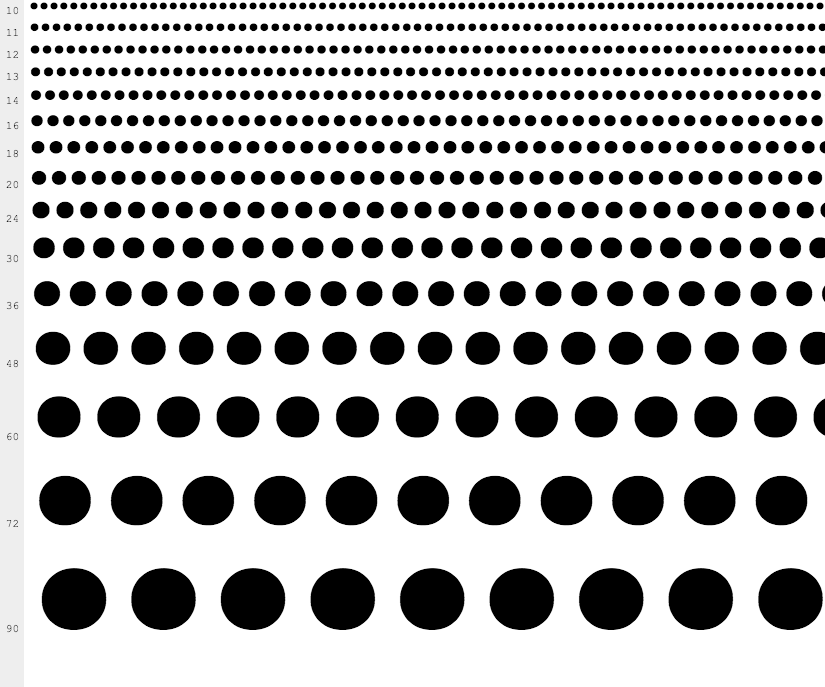

DotsFont: A font made of only dots
(+ Russian and Croatian alphabet)
===
This font is useful if you want to prevent browser from autocompleting passwords and prompting to save them.
This font shows English, Russian, Croatian alphabet, digits and special characters as dots.
In other words it enables functionality of `-webkit-text-security` property.



Usage
---

Download the font

```css
@font-face {
  font-family: 'dotsfont';
  src:
       url('dotsfont.woff') format('woff'),
       url('dotsfont.ttf') format('truetype'),
       url('dotsfont.svg#dotsfontregular') format('svg');
}

[conceal] {
  font-family: 'dotsfont';
}
```

```html
<span conceal>hide me</span>
```

License
---

Copyright (c) 2016, Kyle Welsby (kyle@mekyle.com)

This Font Software is licensed under the SIL Open Font License, Version 1.1. This license is included in this repository (OFL.txt), and is also available with a FAQ at: http://scripts.sil.org/OFL
